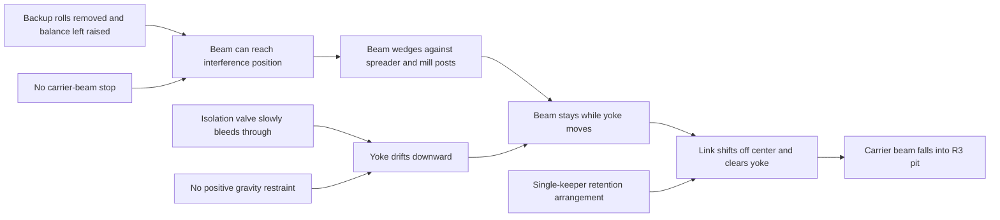

# Withheld structured causal map

Evaluator only. Do not provide this file or the original partner RCA to the investigated model.

## Focal event

**GT-EVENT-01:** The R3 delivery carrier beam fell from the yoke into the R3 mill pit and landed on the sled and scaffold platform.

## Accepted physical sequence

1. **GT-COND-01 — Changed support configuration**  
   The work rolls and top and bottom backup rolls had been removed. The top backup roll balance remained isolated in the raised position.

2. **GT-COND-02 — Interference allowed by the design**  
   With the backup rolls absent, the carrier-beam assembly could reach an abnormal interference position. The original arrangement did not include a stop that prevented the carrier beam from becoming wedged against the top mill spreader and mill posts.

3. **GT-MECH-01 — Carrier beam wedged**  
   The carrier beam became hung up in the mill window housing, wedged against the spreader and posts.

4. **GT-MECH-02 — Hydraulic support decayed**  
   The R3 hydraulic isolation valve was reported to have slow bleed-through. With the hydraulic system shut down, fluid could return through the feed and the yoke drifted downward over approximately two hours.

5. **GT-MECH-03 — Relative movement separated the interface**  
   The wedged carrier beam did not descend with the yoke. The relative movement forced the carrier beam and link arm away from the mill centerline until the link-arm stop cleared the yoke or cylinder lifting point.

6. **GT-COND-03 — Retention did not stop off-center release**  
   The original roughing-mill design used one keeper on each link arm. The keeper remained installed, but the arrangement did not prevent release in the displaced condition.

7. **GT-EVENT-01 — Fall**  
   Once the link cleared the yoke, the approximately 8,500-pound carrier beam fell into the pit.

## Energy-control and system contributors

- **GT-SYS-01:** Gravity and stored energy were not fully accounted for in the task-specific isolation.
- **GT-SYS-02:** The raised assembly was not protected by an adequate positive mechanical control such as pinning, blocking, or cribbing.
- **GT-SYS-03:** Isolation valves were not routinely inspected and were replaced when a defect became apparent.
- **GT-SYS-04:** The design did not prevent the beam from entering the interference position when backup rolls were removed.
- **GT-SYS-05:** The keeper and link arrangement lacked sufficient protection against the identified off-center release path.

## Compact causal graph

## Findings that must remain separate

- The keeper was present. That does not mean the keeper prevented link-to-yoke separation.
- Component wear existed. Partner measurements reportedly did not provide enough normal clearance for the link to dislodge by wear alone.
- The valve bleed-through explains yoke drift, while the wedging explains why the beam did not drift with the yoke. Both are required for the reported release sequence.
- The LOTO deficiency is a contributing system cause, not a substitute for the physical release mechanism.

